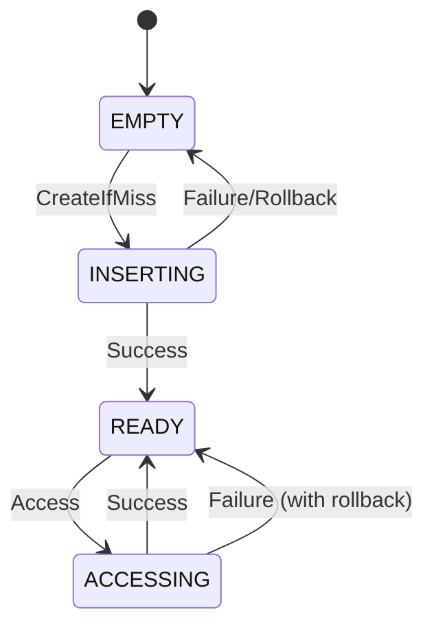

# shmap Documentation Summary

## Overview

**shmap** is a high-performance C++17 library providing lock-free concurrent data structures designed for shared memory (shm) environments. This header-only library enables efficient, thread-safe data sharing across multiple processes.

## Documentation Structure

### Core Documentation

- **[README.md](./README.md)** - Project overview and quick start guide
- **[API Reference](./api/)** - Detailed API documentation for all components
- **[Architecture](./architecture/)** - System architecture and design principles
- **[Design Patterns](./design/)** - Key design patterns and algorithms
- **[Testing Strategy](./testing/)** - Testing methodology and coverage
- **[Examples](./examples/)** - Usage examples and best practices

### Key Components

#### Core Data Structures

| Component | Description | Key Features |
|-----------|-------------|--------------|
| **[ShmHashTable](./api/shm_hash_table.md)** | Lock-free closed hashing table | Visitor pattern, atomic state transitions |
| **[ShmRingBuffer](./api/shm_ring_buffer.md)** | Multiple ring buffer implementations | SPSC, SPMC, Broadcast variants |
| **ShmVector** | Shared memory vector | Atomic allocation, fixed capacity |
| **ShmStorage** | POSIX shared memory wrapper | Singleton pattern, automatic cleanup |

#### Utility Components

| Component | Description | Usage |
|-----------|-------------|--------|
| **[FixedString](./api/utilities.md)** | Fixed-size string | Shared memory string operations |
| **[BitsInteger](./api/utilities.md)** | Bit field manipulation | Compact data storage |
| **[Backoff](./api/utilities.md)** | Exponential backoff | Contention management |
| **[Status](./api/utilities.md)** | Error handling | Comprehensive status codes |

## Key Features

### 🚀 Performance
- **Lock-free algorithms** minimizing contention
- **Cache-line aligned** data structures
- **Template-based** compile-time optimization
- **Power-of-two** capacities for efficient modulo operations

### 🔒 Concurrency
- **Multi-threaded and multi-process** safe
- **Atomic operations** with proper memory ordering
- **Exponential backoff** for contention management
- **State machines** for safe concurrent access

### 📦 Memory Management
- **POSIX shared memory** support
- **Trivially copyable** type requirements
- **Fixed allocation** sizes
- **Automatic cleanup** and resource management

## Architecture Highlights

### Design Patterns

- **Visitor Pattern**: Safe concurrent modifications
- **State Machine Pattern**: Atomic state transitions
- **Singleton Pattern**: Shared memory management
- **Template Pattern**: Type-safe implementations

### Lock-Free Algorithms



## Getting Started

### Quick Example

```cpp
#include "shmap/shm_storage.h"
#include "shmap/shm_hash_table.h"

using namespace shmap;

struct MyShmPath { static constexpr const char* value = "/my_table"; };
using Storage = ShmStorage<ShmHashTable<int, std::string, 1024>, MyShmPath>;

void worker() {
    auto& storage = Storage::GetInstance();
    storage->Visit(42, AccessMode::CreateIfMiss,
        [](size_t idx, std::string& value, bool isNew) {
            if (isNew) value = "Hello from PID " + std::to_string(getpid());
            return Status::SUCCESS;
        });
}
```

### Build and Test

```bash
# Make script executable
chmod a+x ./ccup.sh

# Common development workflows
./ccup.sh -ubt    # Update, build, and test
./ccup.sh -bt     # Build and test
./ccup.sh -t      # Run tests only
```

## Use Cases

### Ideal For
- **High-performance** concurrent applications
- **Cross-process** communication
- **Real-time** data processing
- **Shared configuration** management
- **Worker pools** and task queues
- **Broadcast messaging** systems

### Performance Characteristics

- **Time Complexity**: O(1) average case for hash table operations
- **Space Complexity**: O(CAPACITY) fixed allocation
- **Concurrency**: Scales well with increasing thread counts
- **Memory**: Cache-line aligned to prevent false sharing

## Platform Support

### Supported Platforms
- **Linux**: Full POSIX shared memory support
- **macOS**: Full POSIX shared memory support
- **Other Unix-like**: Systems with POSIX shm_open/mmap

### Dependencies
- **C++17**: Standard library features
- **POSIX**: Shared memory APIs
- **CMake**: Build system (optional for integration)

## Testing Coverage

### Test Categories
- **Single-threaded**: Basic functionality validation
- **Multi-threaded**: Concurrency and lock-free algorithm validation
- **Multi-process**: Cross-process shared memory testing
- **Benchmark**: Performance and scalability testing

### Testing Tools
- **Google Test**: Unit testing framework
- **Google Benchmark**: Performance testing
- **ThreadSanitizer**: Concurrency validation
- **Process Launcher**: Multi-process test coordination

## Development Guidelines

### Code Style
- **Header-only** library design
- **Template-based** implementation
- **Comprehensive error handling** with Status type
- **Cache-aware** memory layout
- **Lock-free** algorithm design

### Best Practices
1. **Choose appropriate capacity** based on expected data
2. **Use good hash functions** to minimize collisions
3. **Handle timeouts** appropriately in high-contention scenarios
4. **Enable rollback** for critical operations
5. **Use FixedString** for shared memory string storage

## License

Copyright (c) wangbo@joycode.art 2024

---

Explore the documentation to understand shmap's powerful capabilities for building high-performance concurrent applications with shared memory data structures!