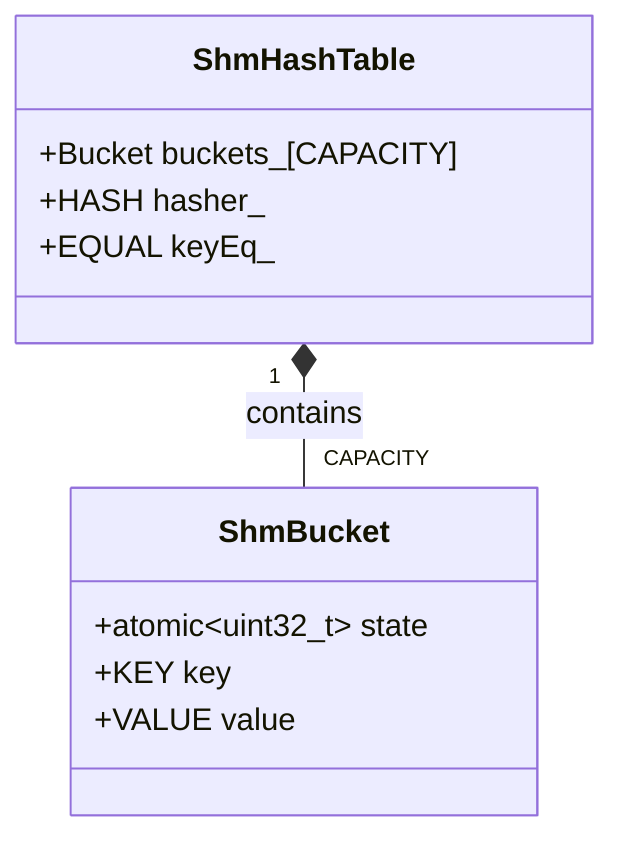

# ShmHashTable API Reference

## Overview

`ShmHashTable` is a lock-free closed hashing table designed for high-concurrency shared memory environments. It uses atomic state transitions and the visitor pattern for safe concurrent access.

## Class Declaration

```cpp
template<typename KEY, typename VALUE, std::size_t CAPACITY,
         typename HASH = std::hash<KEY>,
         typename EQUAL = std::equal_to<KEY>,
         bool ROLLBACK_ENABLE = false>
struct ShmHashTable;
```

## Template Parameters

| Parameter | Description | Requirements |
|-----------|-------------|--------------|
| `KEY` | Key type | Trivially copyable, standard layout |
| `VALUE` | Value type | Trivially copyable, standard layout |
| `CAPACITY` | Table capacity | Must be > 0 |
| `HASH` | Hash function | Default: `std::hash<KEY>` |
| `EQUAL` | Equality comparator | Default: `std::equal_to<KEY>` |
| `ROLLBACK_ENABLE` | Enable rollback | Default: `false` |

## Public Types

```cpp
using Bucket = ShmBucket<KEY, VALUE>;
```

## Public Methods

### Visit

Access or create an element using the visitor pattern.

```cpp
template<typename Visitor>
Status Visit(const KEY& key, AccessMode mode, Visitor&& visitor,
             std::chrono::nanoseconds timeout = std::chrono::seconds(5)) noexcept;
```

**Parameters:**
- `key`: The key to access
- `mode`: Access mode (`AccessExist` or `CreateIfMiss`)
- `visitor`: Callable with signature `Status (size_t idx, VALUE& value, bool isNew)`
- `timeout`: Maximum time to wait for access

**Returns:** `Status` indicating success or failure

**Example:**
```cpp
ShmHashTable<int, std::string, 1024> table;

// Insert new element
auto status = table.Visit(42, AccessMode::CreateIfMiss,
    [](size_t idx, std::string& value, bool isNew) {
        if (isNew) value = "Hello World";
        return Status::SUCCESS;
    });

// Access existing element
status = table.Visit(42, AccessMode::AccessExist,
    [](size_t idx, std::string& value, bool isNew) {
        std::cout << "Value: " << value << std::endl;
        return Status::SUCCESS;
    });
```

### Travel

Enumerate all elements in the table.

```cpp
template<typename Visitor>
Status Travel(Visitor&& visitor,
              std::chrono::nanoseconds timeout = std::chrono::seconds(5)) noexcept;
```

**Parameters:**
- `visitor`: Callable with signature `Status (size_t idx, const KEY& key, VALUE& value)`
- `timeout`: Maximum time to wait for access

**Returns:** `Status` indicating success or failure

**Example:**
```cpp
table.Travel([](size_t idx, const int& key, std::string& value) {
    std::cout << "Key: " << key << ", Value: " << value << std::endl;
    return Status::SUCCESS;
});
```

### VisitBucket

Access a specific bucket by index (exclusive access).

```cpp
template<typename Visitor>
Status VisitBucket(std::size_t bucketId, Visitor&& visitor) noexcept;
```

**Parameters:**
- `bucketId`: Bucket index (0 to CAPACITY-1)
- `visitor`: Callable with signature `Status (Bucket&)`

**Returns:** `Status` indicating success or failure

**Example:**
```cpp
table.VisitBucket(5, [](auto& bucket) {
    std::cout << "Bucket state: " << bucket.state.load() << std::endl;
    return Status::SUCCESS;
});
```

### TravelBucket

Enumerate all buckets (exclusive access).

```cpp
template<typename Visitor>
Status TravelBucket(Visitor&& visitor) noexcept;
```

**Parameters:**
- `visitor`: Callable with signature `Status (size_t idx, Bucket&)`

**Returns:** `Status` indicating success or failure

## Bucket States

Each bucket can be in one of four states:

| State | Value | Description |
|-------|-------|-------------|
| `EMPTY` | 0 | Bucket is empty and available |
| `INSERTING` | 1 | Bucket is being inserted into |
| `READY` | 2 | Bucket contains valid data |
| `ACCESSING` | 3 | Bucket is being accessed |

## Access Mode

```cpp
enum class AccessMode : uint8_t {
    AccessExist,    // Only access existing elements
    CreateIfMiss,   // Create element if it doesn't exist
};
```

## Rollback Support

When `ROLLBACK_ENABLE` is `true`, failed operations automatically roll back changes:

```cpp
using Table = ShmHashTable<int, std::string, 1024,
                           std::hash<int>, std::equal_to<int>, true>;

Table table;
table.Visit(42, AccessMode::CreateIfMiss,
    [](size_t idx, std::string& value, bool isNew) {
        value = "Temporary";
        return Status::ERROR; // This will roll back the change
    });
```

## Memory Layout



## Performance Characteristics

- **Time Complexity**: O(1) average case for access operations
- **Space Complexity**: O(CAPACITY) fixed allocation
- **Concurrency**: Lock-free, scales with thread count
- **Memory**: Cache-line aligned buckets prevent false sharing

## Error Conditions

| Status | Condition |
|--------|-----------|
| `SUCCESS` | Operation completed successfully |
| `NOT_FOUND` | Element not found (AccessExist mode) |
| `TIMEOUT` | Could not acquire bucket within timeout |
| `INVALID_ARGUMENT` | Invalid bucket ID provided |

## Usage Notes

1. **Capacity Planning**: Choose capacity based on expected element count
2. **Hash Function**: Use good hash functions to minimize collisions
3. **Timeout Values**: Adjust timeout based on expected contention
4. **Visitor Safety**: Visitors should not throw exceptions
5. **Memory Ordering**: Uses appropriate memory barriers for cross-process visibility

## Example: Multi-threaded Usage

```cpp
ShmHashTable<int, int, 1024> table;

std::vector<std::thread> threads;
for (int i = 0; i < 10; ++i) {
    threads.emplace_back([&table, i]() {
        for (int j = 0; j < 100; ++j) {
            table.Visit(j, AccessMode::CreateIfMiss,
                [i](size_t idx, int& value, bool isNew) {
                    if (isNew) value = 0;
                    value += i;
                    return Status::SUCCESS;
                });
        }
    });
}

for (auto& t : threads) t.join();
```

This API provides safe, high-performance concurrent access to shared hash tables with comprehensive error handling and timeout support.