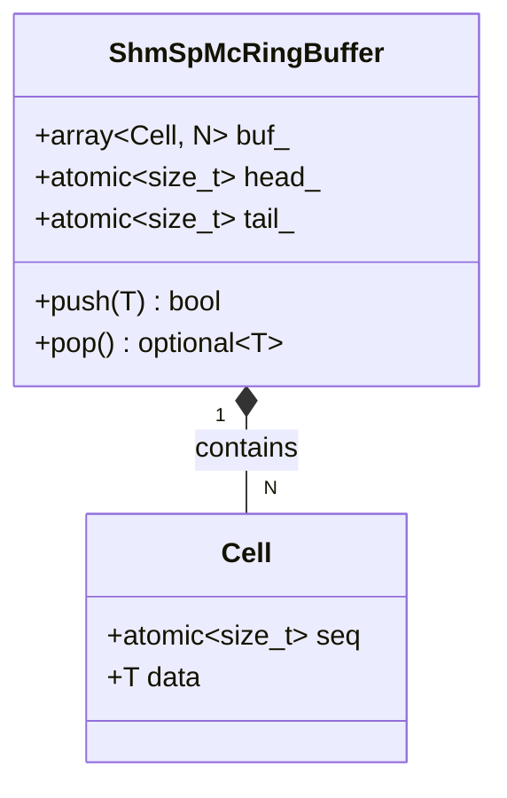
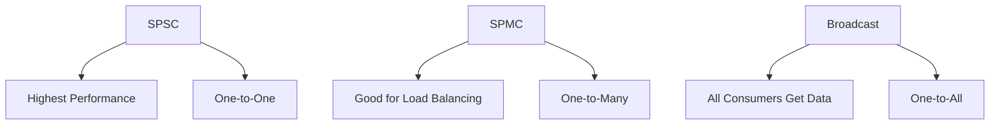

# ShmRingBuffer API Reference

## Overview

shmap provides multiple lock-free ring buffer implementations optimized for different producer-consumer patterns in shared memory environments.

## Available Implementations

| Implementation | Pattern | Description |
|----------------|---------|-------------|
| **ShmRingBuffer** | SPSC | Single Producer Single Consumer |
| **ShmSpMcRingBuffer** | SPMC | Single Producer Multiple Consumers |
| **BroadcastRingBuffer** | Broadcast | Single Producer, All Consumers |

## ShmRingBuffer (SPSC)

Single Producer Single Consumer ring buffer.

### Class Declaration

```cpp
template <typename T, std::size_t N>
struct ShmRingBuffer;
```

### Template Parameters

| Parameter | Description | Requirements |
|-----------|-------------|--------------|
| `T` | Element type | Trivially copyable, standard layout |
| `N` | Capacity | Power of two |

### Public Methods

#### Capacity and Size

```cpp
std::size_t capacity() const noexcept;  // Returns N
std::size_t size() const noexcept;      // Current element count
bool empty() const noexcept;            // True if size == 0
bool full() const noexcept;             // True if size >= N
```

#### Operations

```cpp
void clear() noexcept;                  // Reset buffer
bool push(const T& v) noexcept;         // Add element (producer)
std::optional<T> pop() noexcept;        // Remove element (consumer)
```

### Example Usage

```cpp
ShmRingBuffer<int, 1024> buffer;

// Producer thread
if (buffer.push(42)) {
    std::cout << "Element added" << std::endl;
}

// Consumer thread
if (auto value = buffer.pop()) {
    std::cout << "Got: " << *value << std::endl;
}
```

## ShmSpMcRingBuffer (SPMC)

Single Producer Multiple Consumers ring buffer. Only one consumer successfully fetches each element.

### Class Declaration

```cpp
template <typename T, std::size_t N>
struct ShmSpMcRingBuffer;
```

### Public Methods

#### Operations

```cpp
bool push(const T& v) noexcept;         // Add element (producer)
std::optional<T> pop() noexcept;        // Remove element (consumer)
std::size_t size() const noexcept;      // Current element count
void clear() noexcept;                  // Reset buffer
```

### Internal Structure



### Example Usage

```cpp
ShmSpMcRingBuffer<std::string, 256> buffer;

// Producer
buffer.push("message1");

// Multiple consumers
std::vector<std::thread> consumers;
for (int i = 0; i < 3; ++i) {
    consumers.emplace_back([&buffer, i]() {
        if (auto msg = buffer.pop()) {
            std::cout << "Consumer " << i << " got: " << *msg << std::endl;
        }
    });
}
```

## BroadcastRingBuffer

Single Producer ring buffer where all consumers successfully fetch each element.

### Class Declaration

```cpp
template<typename T, std::size_t N, std::size_t MAX_CONSUMER = 8>
struct BroadcastRingBuffer;
```

### Template Parameters

| Parameter | Description | Default |
|-----------|-------------|---------|
| `T` | Element type | - |
| `N` | Capacity | Power of two |
| `MAX_CONSUMER` | Maximum consumers | 8 |

### Public Methods

#### Initialization

```cpp
void init(std::uint32_t consumers) noexcept;  // Set consumer count
```

#### Operations

```cpp
std::size_t size() const noexcept;      // Estimated element count
void clear() noexcept;                  // Reset buffer (when stopped)
bool push(const T& v) noexcept;         // Add element (producer)
```

#### Consumer Management

```cpp
Consumer make_consumer() noexcept;      // Create consumer instance
```

### Consumer Interface

```cpp
struct Consumer {
    BroadcastRingBuffer* rb;            // Parent buffer
    std::size_t cursor;                 // Consumer position

    std::optional<T> pop() noexcept;    // Get next element
};
```

### Example Usage

```cpp
BroadcastRingBuffer<int, 64> buffer;
buffer.init(3);  // Expect 3 consumers

// Producer
buffer.push(100);
buffer.push(200);

// Multiple consumers (each gets all messages)
std::vector<std::thread> consumers;
for (int i = 0; i < 3; ++i) {
    consumers.emplace_back([&buffer, i]() {
        auto consumer = buffer.make_consumer();
        while (auto value = consumer.pop()) {
            std::cout << "Consumer " << i << " got: " << *value << std::endl;
        }
    });
}
```

## Performance Comparison



## Memory Layout

All ring buffers use power-of-two capacities for efficient modulo operations:

```cpp
// Instead of: index % capacity
// Use: index & (capacity - 1)  // When capacity is power of two
```

## Error Handling

- **Push operations**: Return `false` when buffer is full
- **Pop operations**: Return `std::nullopt` when buffer is empty
- **No exceptions**: All operations are `noexcept`

## Thread Safety

| Operation | SPSC | SPMC | Broadcast |
|-----------|------|------|-----------|
| **Push** | Single producer | Single producer | Single producer |
| **Pop** | Single consumer | Multiple consumers | Multiple consumers |
| **Concurrent Push/Pop** | Safe | Safe | Safe |

## Capacity Planning

- Choose capacity based on expected data rate and processing latency
- Power-of-two sizes enable efficient modulo operations
- Consider memory usage: `sizeof(T) * N` for buffer storage

## Usage Recommendations

- **SPSC**: When you have exactly one producer and one consumer
- **SPMC**: When you want to distribute work among multiple consumers
- **Broadcast**: When all consumers need to process all messages

## Example: Real-time Data Processing

```cpp
// SPSC for high-performance sensor data
ShmRingBuffer<SensorData, 4096> sensor_buffer;

// SPMC for worker pool
ShmSpMcRingBuffer<WorkItem, 1024> work_queue;

// Broadcast for logging/monitoring
BroadcastRingBuffer<LogMessage, 256> log_broadcast;
```

These ring buffer implementations provide efficient, lock-free data transfer between producers and consumers in shared memory environments.