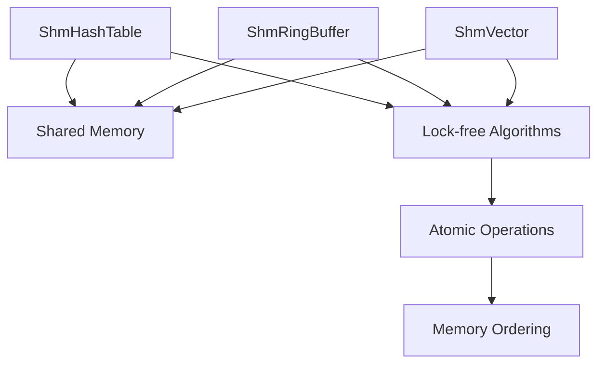
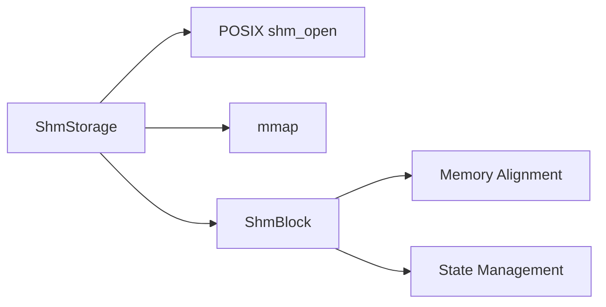
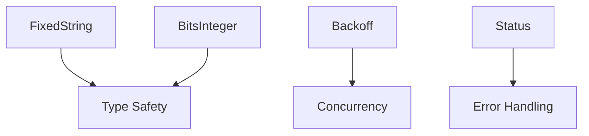
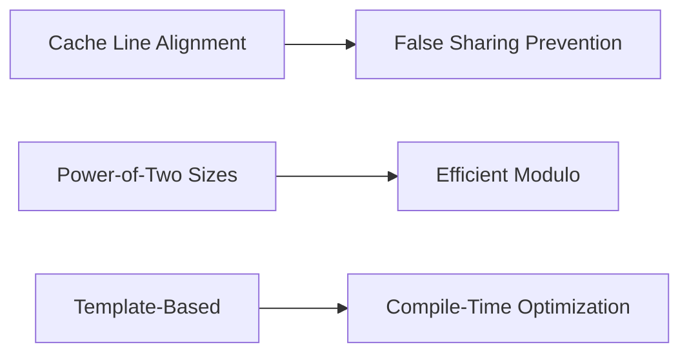
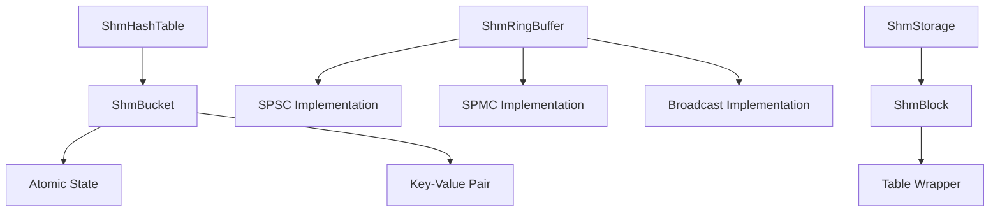
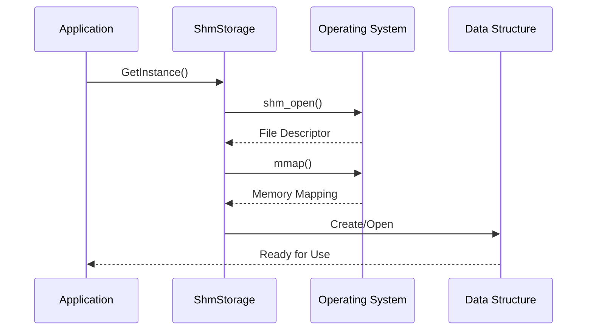

# shmap Architecture Overview

## System Architecture

shmap is designed as a header-only C++17 library with a modular architecture focused on lock-free concurrent data structures for shared memory environments.

## Core Components

### 1. Data Structures Layer

### 2. Memory Management Layer

### 3. Utility Layer

## Design Principles

### 1. Lock-Free Concurrency

All data structures implement lock-free algorithms using atomic operations:

- **Atomic State Transitions**: State machines for safe concurrent access
- **Memory Ordering**: Proper `std::memory_order` for visibility guarantees
- **Exponential Backoff**: Contention management for high-load scenarios

### 2. Shared Memory First

Designed specifically for cross-process communication:

- **POSIX Compliance**: Uses standard POSIX shared memory APIs
- **Trivial Copyability**: All stored types must be trivially copyable
- **Standard Layout**: Ensures consistent memory layout across processes

### 3. Cache-Aware Design

## Component Relationships

### Core Data Structure Hierarchy

### Memory Management Flow

## Key Architectural Decisions

### 1. Header-Only Design
- **Advantage**: No linking dependencies, easy integration
- **Trade-off**: Larger compile times, template complexity

### 2. Template-Based Implementation
- **Advantage**: Type safety, compile-time optimization
- **Trade-off**: Code bloat, complex error messages

### 3. Visitor Pattern for Concurrency
- **Advantage**: Safe concurrent modifications, clear ownership
- **Trade-off**: More complex API, lambda overhead

### 4. POSIX Shared Memory
- **Advantage**: Standardized, cross-platform (Unix-like)
- **Limitation**: Windows compatibility requires alternative implementation

## Performance Characteristics

### Memory Usage
- **Fixed Allocation**: All data structures have compile-time fixed sizes
- **Cache Alignment**: 64-byte cache line alignment prevents false sharing
- **Minimal Overhead**: Atomic operations with minimal memory footprint

### Concurrency Scaling
- **Lock-Free**: Scales well with increasing thread counts
- **Contention Management**: Exponential backoff for high contention
- **Memory Ordering**: Optimized for common access patterns

## Platform Support

### Supported Platforms
- **Linux**: Full POSIX shared memory support
- **macOS**: Full POSIX shared memory support
- **Other Unix-like**: Systems with POSIX shm_open/mmap

### Dependencies
- **C++17**: Standard library features
- **POSIX**: Shared memory APIs
- **CMake**: Build system (optional for integration)

## Extension Points

The architecture supports extension through:

1. **Custom Hash Functions**: Template parameter for ShmHashTable
2. **New Data Structures**: Implement using ShmStorage pattern
3. **Alternative Memory Backends**: Replace POSIX with other shared memory systems
4. **Custom Backoff Strategies**: Replace default exponential backoff

This modular architecture enables shmap to provide high-performance concurrent data structures while maintaining flexibility and type safety.