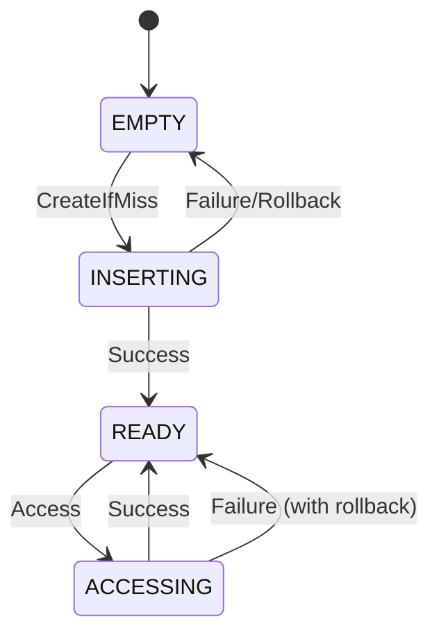
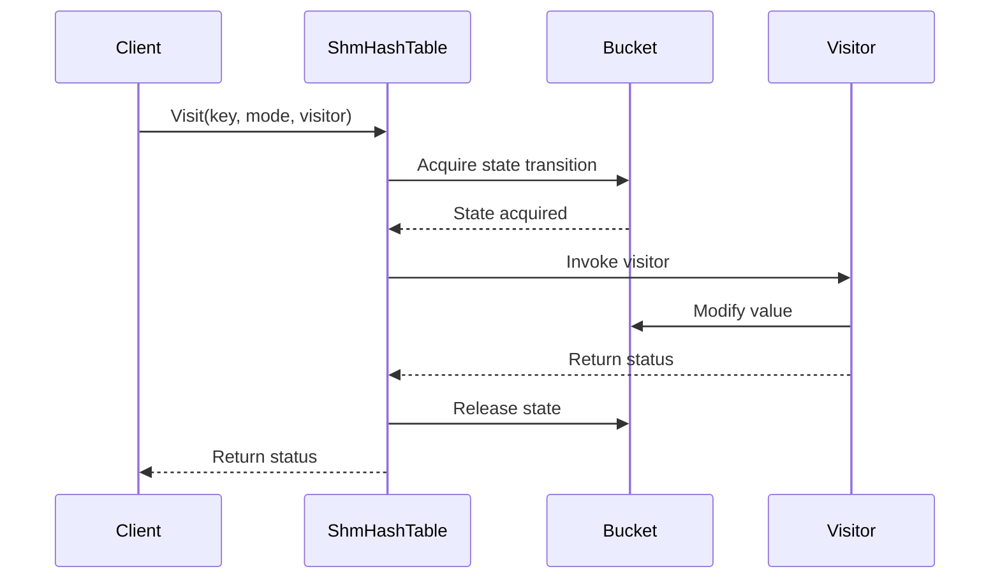
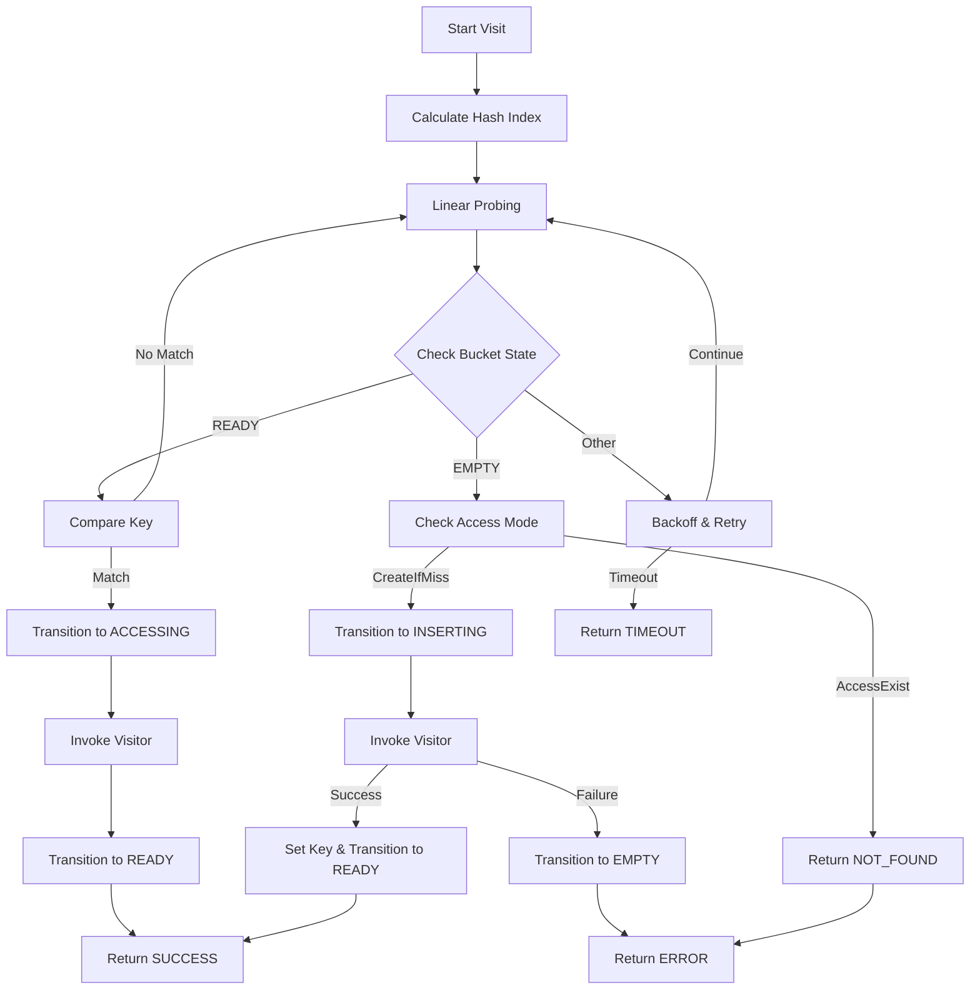
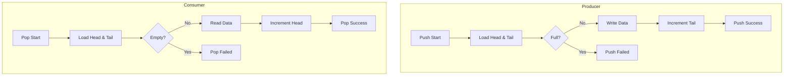
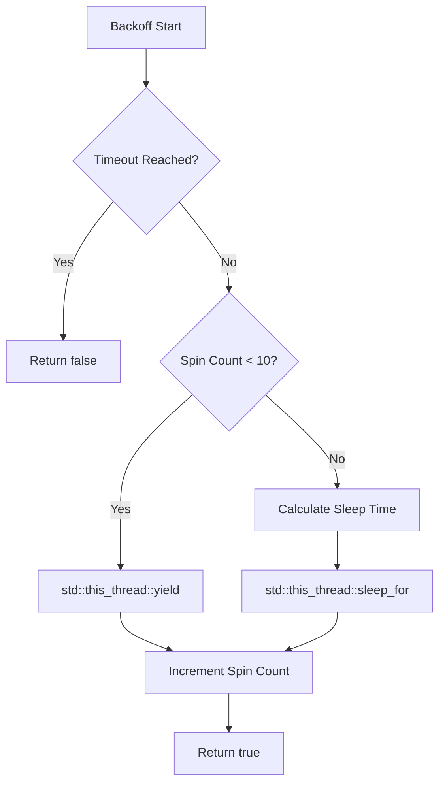
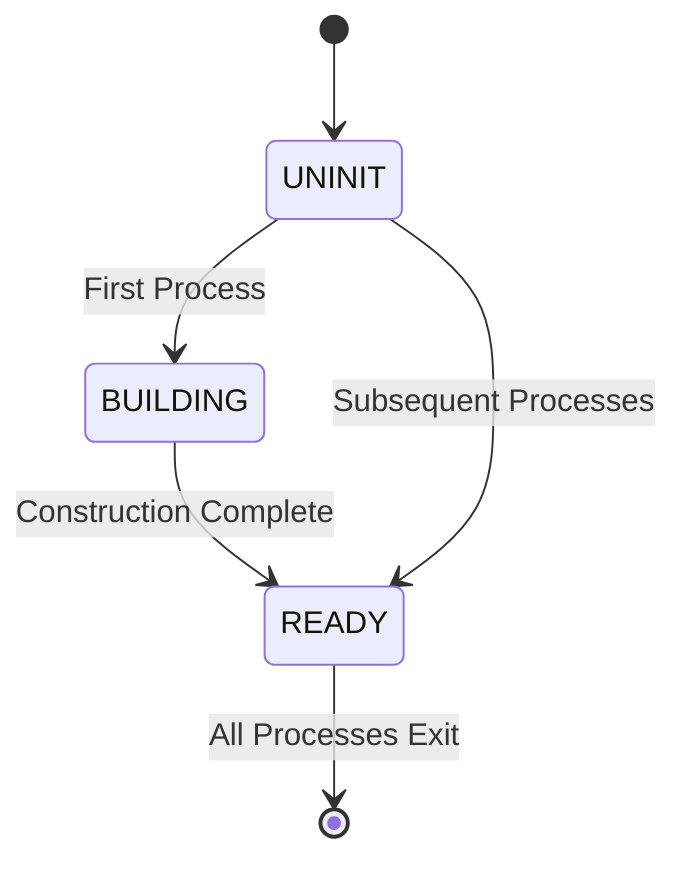
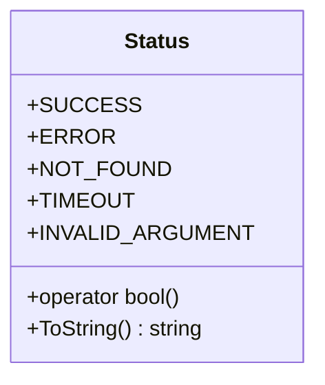

# Lock-Free Algorithm Design

## Overview

shmap implements sophisticated lock-free algorithms using atomic operations and state machines to provide high-performance concurrent data structures for shared memory environments.

## Core Design Patterns

### 1. Atomic State Machine Pattern

Used in `ShmHashTable` for safe concurrent bucket access:



### 2. Visitor Pattern for Safe Modification

All modifications go through visitor callbacks:



## ShmHashTable Algorithm

### Bucket State Transitions

```cpp
enum BucketState {
    EMPTY = 0,      // Available for insertion
    INSERTING = 1,  // Being inserted into
    READY = 2,      // Contains valid data
    ACCESSING = 3   // Being accessed
};
```

### Visit Algorithm



### Memory Ordering Strategy

```cpp
// Load with acquire semantics
auto state = b.state.load(std::memory_order_acquire);

// Compare-exchange with acquire-release
if (!b.state.compare_exchange_strong(expect, new_state,
        std::memory_order_acq_rel, std::memory_order_acquire)) {
    // Retry logic
}

// Store with release semantics
b.state.store(new_state, std::memory_order_release);
```

## Ring Buffer Algorithms

### SPSC (Single Producer Single Consumer)



### SPMC (Single Producer Multiple Consumers)

Uses sequence numbers for coordination:

```cpp
struct Cell {
    std::atomic<std::size_t> seq;  // Sequence number
    T data;                        // Payload
};
```

**Producer Algorithm:**
```cpp
bool push(const T& v) {
    std::size_t pos = tail_.load(std::memory_order_relaxed);

    for (;;) {
        Cell& c = buf_[pos & (N - 1)];
        std::size_t seq = c.seq.load(std::memory_order_acquire);
        intptr_t diff = static_cast<intptr_t>(seq) - static_cast<intptr_t>(pos);

        if (diff == 0) { // Empty cell
            if (tail_.compare_exchange_weak(pos, pos + 1)) {
                c.data = v;
                c.seq.store(pos + 1, std::memory_order_release);
                return true;
            }
        } else if (diff < 0) {
            return false; // Full
        } else {
            pos = tail_.load(std::memory_order_relaxed);
        }
    }
}
```

## Backoff Algorithm

Exponential backoff for contention management:



**Implementation:**
```cpp
bool Backoff::next() {
    if (Clock::now() - start_ > timeout_) return false;

    if (spin_ < YIELD_LIMIT) {
        std::this_thread::yield();
    } else {
        int expected = std::min(spin_ - YIELD_LIMIT, MAX_BACKOFF_EXP);
        auto nanos = std::chrono::nanoseconds(1LL << expected);
        std::this_thread::sleep_for(nanos);
    }
    ++spin_;
    return true;
}
```

## Cross-Process Coordination

### ShmStorage State Management



**Implementation:**
```cpp
static ShmBlock* Create(void* mem) {
    auto* block = static_cast<ShmBlock*>(mem);
    uint32_t expectedState = UNINIT;
    if (block->state.compare_exchange_strong(expectedState, BUILDING)) {
        new (&block->table_) TABLE();  // Placement new
        block->state.store(READY, std::memory_order_release);
        return block;
    } else {
        block->WaitReady();  // Wait for other process
        return block;
    }
}
```

## Performance Optimizations

### Cache Line Alignment

All shared data structures are cache-line aligned:

```cpp
struct alignas(CACHE_LINE_SIZE) ShmBucket {
    std::atomic<uint32_t> state;
    KEY key;
    VALUE value;
};
```

### Power-of-Two Sizes

Ring buffers use power-of-two capacities for efficient modulo:

```cpp
// Instead of expensive modulo:
index = pos % capacity;

// Use bitwise AND:
index = pos & (capacity - 1);  // When capacity is power of two
```

### Template-Based Optimization

Compile-time optimizations through templates:

```cpp
template<bool ROLLBACK_ENABLE>
Status ApplyVisitor(Visitor&& visitor, VALUE* oldValue, ...) {
    // Compile-time conditional
    if constexpr (ROLLBACK_ENABLE) {
        if (!result && oldValue) {
            value = *oldValue;  // Rollback
        }
    }
    return result;
}
```

## Error Handling Design

### Comprehensive Status Codes



### Exception Safety

All operations are `noexcept` with comprehensive error codes:

```cpp
template<typename Visitor, typename ...Args>
Status ApplyVisitor(Visitor&& visitor, Args&&... args) noexcept {
    Status result = Status::SUCCESS;
    try {
        if constexpr (std::is_same_v<std::invoke_result_t<Visitor, Args...>, void>) {
            std::forward<Visitor>(visitor)(std::forward<Args>(args)...);
        } else {
            result = std::forward<Visitor>(visitor)(std::forward<Args>(args)...);
        }
    } catch (...) {
        result = Status::EXCEPTION;
    }
    return result;
}
```

## Testing Strategy

### Concurrency Testing

- **Single-threaded**: Basic functionality validation
- **Multi-threaded**: Lock-free algorithm validation
- **Multi-process**: Cross-process coordination testing
- **Stress testing**: High contention scenarios

### Algorithm Validation

```cpp
TEST(ShmHashTableTest, ConcurrentInsertDistinctKeys) {
    ShmHashTable<int, int, 1024> table;

    std::vector<std::thread> threads;
    for (int i = 0; i < 10; ++i) {
        threads.emplace_back([&table, i]() {
            for (int j = 0; j < 100; ++j) {
                int key = i * 100 + j;
                table.Visit(key, AccessMode::CreateIfMiss,
                    [](auto idx, auto& value, bool isNew) {
                        if (isNew) value = 1;
                        return Status::SUCCESS;
                    });
            }
        });
    }

    for (auto& t : threads) t.join();

    // Validate all inserts succeeded
    int count = 0;
    table.Travel([&count](auto idx, auto& key, auto& value) {
        ++count;
        return Status::SUCCESS;
    });

    EXPECT_EQ(count, 1000);
}
```

These lock-free algorithm designs provide the foundation for shmap's high-performance concurrent data structures, ensuring correctness under heavy contention while maintaining excellent performance characteristics.